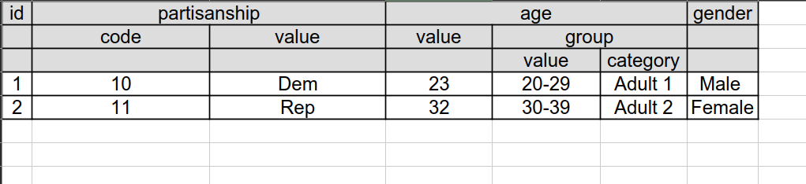

## Read Data

Reading files from disk is handled by the function method `read_data()`.
This same function can be used regardless of the file type. The function
accepts relative paths and various file formats, such as `csv`, `xlsx`,
`txt`, `dta`, `Rdata`, `rds`, `sav`, and others. The type of the file is
inferred from the file extension.

The extensions currently supported are:

``` org
- csv-like: csv, dat, tsv, txt
- excel-like: ods, xls, xlsx, xlt, xltx
- R files: rda, rdata, rds
- Stata files: dta
- SPSS files: sav
- URL: url with any of the supported file types
- Google Drive Spreadsheet: see documentation
```

It also supports files with:

-   Hierarchical headings. See the example
    [here](#files-with-hierarchical-headings).
-   Labeled data. See the examples [here](#files-with-labels).

The function `read_data()` will return a tidypolars$^{4sci}$ `tibble`
or, if the file contains labeled data, a tuple (`tibble`,
`DATA_LABELS`).

## Examples

### Simple example (CSV file)

Here is the file used in this example:
[example.csv](../src/data/example.csv). To read this file into Python,
use:

``` {.python exports="both" results="output code" tangle="src-read-write.py" cache="yes" noweb="no" session="*Python*" title="Loading data" linenums="1"}
import tidypolars4sci_ext as tp

fn = "example.csv"     # change the file path to where your saved the file
df = tp.read_data(fn=fn)

```

``` python
Loading data 'example.csv'... done!
```

``` {.python exports="both" results="output code" tangle="src-read-write.py" cache="yes" noweb="no" session="*Python*" linenums="1"}

df.head().print()

```

``` python
shape: (3, 2)
┌───────────┐
│   a     b │
│ i64   i64 │
╞═══════════╡
│   1     4 │
│   2     5 │
│   3     6 │
└───────────┘
```

### Labelled data (Rdata, dta, etc.) {#files-with-labels}

Some file types, such as SPSS (`.sav`), Stata (`.dta`), and R
(`.rda, .Rdata`, etc.), support variable and value labels. When reading
data from these files, the `read_data` function returns a tuple
`(data, DATA_LABELS)`.

The `DATA_LABELS` contains two properties:

-   `variables`: a dictionary with variable names (dictionary keys) and
    their labels (dictionary values). Variables with no labels in the
    file are represented in the dictionary with their variable names as
    both the key and the value.
-   `values`: a dictionary with variable names (dictionary keys) and the
    labels of the variable values (dictionary values). Variables with no
    labeled values are omitted from the value label dictionary.

Here is an example with a Stata file:

-   [mtcars-labels.dta](../src/data/mtcars-labels.dta)

``` {.python exports="both" results="output code" tangle="src-read.py" cache="yes" noweb="no" session="*Python*" linenums="1" eval="always"}
fn = "mtcars-labels.dta"     # change the file path to where your saved the file
df, labels = tp.read_data(fn=fn)
```

``` python
Loading data 'mtcars-labels.dta'... done!
```

The data:

``` {.python exports="both" results="output code" tangle="src-read.py" cache="yes" noweb="no" session="*Python*" linenums="1" eval="always"}
df.head().print()
```

``` python
shape: (5, 12)
┌─────────────────────────────────────────────────────────────────────────────────────────────────────┐
│   mpg    cyl     disp       hp   drat     wt    qsec     vs    am   gear   carb   name              │
│   f64    f64      f64      f64    f64    f64     f64    f64   i32    f64    f64   str               │
╞═════════════════════════════════════════════════════════════════════════════════════════════════════╡
│ 21.00   6.00   160.00   110.00   3.90   2.62   16.46   0.00     2   4.00   4.00   Mazda RX4         │
│ 21.00   6.00   160.00   110.00   3.90   2.88   17.02   0.00     2   4.00   4.00   Mazda RX4 Wag     │
│ 22.80   4.00   108.00    93.00   3.85   2.32   18.61   1.00     2   4.00   1.00   Datsun 710        │
│ 21.40   6.00   258.00   110.00   3.08   3.21   19.44   1.00     1   3.00   1.00   Hornet 4 Drive    │
│ 18.70   8.00   360.00   175.00   3.15   3.44   17.02   0.00     1   3.00   2.00   Hornet Sportabout │
└─────────────────────────────────────────────────────────────────────────────────────────────────────┘
```

The labels

``` {.python exports="both" results="output code" tangle="src-read.py" cache="yes" noweb="no" session="*Python*" linenums="1" eval="always"}
from pprint import pprint as print_dict # just to print dictionary nicely

print("Variable labels:")
print_dict(labels.variables)
print("Variables values and their label:")
print_dict(labels.values)
```

``` python
Variable labels:
{'am': 'am',
 'carb': 'carb',
 'cyl': 'Number of cylinders',
 'disp': 'disp',
 'drat': 'drat',
 'gear': 'Number of forward gears',
 'hp': 'hp',
 'mpg': 'mpg',
 'name': 'name',
 'qsec': 'qsec',
 'vs': 'vs',
 'wt': 'wt'}
Variables values and their label:
{'am': {np.int32(1): 'Zero', np.int32(2): 'One'},
 'cyl': {np.int32(4): 'Four ', np.int32(6): 'Six ', np.int32(8): 'Eight '},
 'gear': {np.int32(3): 'Three forward gears',
          np.int32(4): 'Four forward gears',
          np.int32(5): 'Five forward gears'}}
```

To replace variable names with their labels, use:

``` {.python exports="both" results="output code" tangle="src-read.py" cache="yes" noweb="no" session="*Python*" linenums="1" eval="always"}
df_var_labelled = df.select(labels.variables)
df_var_labelled.head().print()
```

``` python
shape: (5, 12)
┌───────────────────────────────────────────────────────────────────────────────────────────────────────────────────────────────────────┐
│   mpg   Number of cylinders     disp       hp   drat     wt    qsec     vs    am   Number of forward gears   carb   name              │
│   f64                   f64      f64      f64    f64    f64     f64    f64   i32                       f64    f64   str               │
╞═══════════════════════════════════════════════════════════════════════════════════════════════════════════════════════════════════════╡
│ 21.00                  6.00   160.00   110.00   3.90   2.62   16.46   0.00     2                      4.00   4.00   Mazda RX4         │
│ 21.00                  6.00   160.00   110.00   3.90   2.88   17.02   0.00     2                      4.00   4.00   Mazda RX4 Wag     │
│ 22.80                  4.00   108.00    93.00   3.85   2.32   18.61   1.00     2                      4.00   1.00   Datsun 710        │
│ 21.40                  6.00   258.00   110.00   3.08   3.21   19.44   1.00     1                      3.00   1.00   Hornet 4 Drive    │
│ 18.70                  8.00   360.00   175.00   3.15   3.44   17.02   0.00     1                      3.00   2.00   Hornet Sportabout │
└───────────────────────────────────────────────────────────────────────────────────────────────────────────────────────────────────────┘
```

To replace values with their labels, use:

``` {.python exports="both" results="output code" tangle="src-read.py" cache="yes" noweb="no" session="*Python*" linenums="1" eval="always"}
df_with_value_labels = df.replace(labels.values)
df_with_value_labels.head().print()
```

``` python
shape: (5, 12)
┌───────────────────────────────────────────────────────────────────────────────────────────────────────────────────────┐
│   mpg   cyl        disp       hp   drat     wt    qsec     vs   am     gear                  carb   name              │
│   f64   str         f64      f64    f64    f64     f64    f64   str    str                    f64   str               │
╞═══════════════════════════════════════════════════════════════════════════════════════════════════════════════════════╡
│ 21.00   Six      160.00   110.00   3.90   2.62   16.46   0.00   One    Four forward gears    4.00   Mazda RX4         │
│ 21.00   Six      160.00   110.00   3.90   2.88   17.02   0.00   One    Four forward gears    4.00   Mazda RX4 Wag     │
│ 22.80   Four     108.00    93.00   3.85   2.32   18.61   1.00   One    Four forward gears    1.00   Datsun 710        │
│ 21.40   Six      258.00   110.00   3.08   3.21   19.44   1.00   Zero   Three forward gears   1.00   Hornet 4 Drive    │
│ 18.70   Eight    360.00   175.00   3.15   3.44   17.02   0.00   Zero   Three forward gears   2.00   Hornet Sportabout │
└───────────────────────────────────────────────────────────────────────────────────────────────────────────────────────┘
```

It is easy to replace labels for only some variables. Here is an example
of using a variable label only for `cyl` and value labels only for
`gear` and `am`:

``` {.python exports="both" results="output code" tangle="src-read.py" cache="yes" noweb="no" session="*Python*" linenums="1" eval="always"}
var_to_label = ['cyl']
values_to_label = ['am', 'gear']

var_to_label = {v:(l if v in var_to_label else v) for v, l in labels.variables.items()} 
values_to_label = {v:l for v, l in labels.values.items() if v in values_to_label} 

df_labelled = (df
               .select(var_to_label)
               .replace(values_to_label)
               )
df_labelled.head().print()
```

``` python
shape: (5, 12)
┌────────────────────────────────────────────────────────────────────────────────────────────────────────────────────────────────────┐
│   mpg   Number of cylinders     disp       hp   drat     wt    qsec     vs   am     gear                  carb   name              │
│   f64                   f64      f64      f64    f64    f64     f64    f64   str    str                    f64   str               │
╞════════════════════════════════════════════════════════════════════════════════════════════════════════════════════════════════════╡
│ 21.00                  6.00   160.00   110.00   3.90   2.62   16.46   0.00   One    Four forward gears    4.00   Mazda RX4         │
│ 21.00                  6.00   160.00   110.00   3.90   2.88   17.02   0.00   One    Four forward gears    4.00   Mazda RX4 Wag     │
│ 22.80                  4.00   108.00    93.00   3.85   2.32   18.61   1.00   One    Four forward gears    1.00   Datsun 710        │
│ 21.40                  6.00   258.00   110.00   3.08   3.21   19.44   1.00   Zero   Three forward gears   1.00   Hornet 4 Drive    │
│ 18.70                  8.00   360.00   175.00   3.15   3.44   17.02   0.00   Zero   Three forward gears   2.00   Hornet Sportabout │
└────────────────────────────────────────────────────────────────────────────────────────────────────────────────────────────────────┘
```

### Files with Hierarchical Headers {#files-with-hierarchical-headings}

Some files have a hierarchical or multiple level header, that is, a
header spanning more than one row. Here is an example with a header
organized hierarchically in 3 levels:

{#example-3-headers}

A file with this example can be downloaded here:
[example-3-header.xlsx](../src/data/example-1-header.xlsx).

The `read_data()` function can read these files into a tidy format and
automatically add level information to the column names. The user just
needs to inform the number of rows with the heading using the argument
`n_headers`. Here is the code:

``` {.python exports="both" results="output code" tangle="src-read.py" cache="yes" noweb="no" session="*Python*" linenums="1" eval="always"}

fn = "./example-3-headers.xlsx" # change the file path to where your saved the file
df = tp.read_data(fn=fn, n_headers=3)
df.print()

```

``` python
Loading data 'example-3-headers.xlsx'... done!
shape: (2, 7)
┌──────────────────────────────────────────────────────────────────────────────────────────────────────────────────────┐
│  id   partisanship (code)   partisanship (value)   age (value)   age (group; value)   age (group; category)   gender │
│ i64                   i64   str                            i64   str                  str                     str    │
╞══════════════════════════════════════════════════════════════════════════════════════════════════════════════════════╡
│   1                    10   Dem                             23   20-29                Adult 1                 Male   │
│   2                    11   Rep                             32   30-39                Adult 2                 Female │
└──────────────────────────────────────────────────────────────────────────────────────────────────────────────────────┘
```

If it is possible to change how the lower-level information is added to
the main header using `header_combine_rule`:

``` {.python exports="both" results="output code" tangle="src-read.py" cache="yes" noweb="no" session="*Python*" linenums="1" eval="always"}
df = tp.read_data(fn=fn, n_headers=3,
                  header_combine_rule = lambda levels: '_'.join(levels))
df.print()
```

``` python
Loading data 'example-3-headers.xlsx'... done!
shape: (2, 7)
┌──────────────────────────────────────────────────────────────────────────────────────────────────────────┐
│  id   partisanship_code   partisanship_value   age_value   age_group_value   age_group_category   gender │
│ i64                 i64   str                        i64   str               str                  str    │
╞══════════════════════════════════════════════════════════════════════════════════════════════════════════╡
│   1                  10   Dem                         23   20-29             Adult 1              Male   │
│   2                  11   Rep                         32   30-39             Adult 2              Female │
└──────────────────────────────────────────────────────────────────────────────────────────────────────────┘
```

### Reading file from URL

To lead data from a URL pointing to the data file, use:

``` {.python exports="both" results="output code" tangle="src-read.py" cache="yes" noweb="no" session="*Python*" linenums="1" eval="always"}
fn = 'https://diogoferrari.com/tidypolars4sci/src/data/example.csv'
df = tp.read_data(fn=fn)
df.head().print()
```

``` python
Loading data 'example.csv'... done!
shape: (3, 2)
┌───────────┐
│   a     b │
│ i64   i64 │
╞═══════════╡
│   1     4 │
│   2     5 │
│   3     6 │
└───────────┘
```

### Reading from Google Sheets

`read_data()` uses [gspread](https://docs.gspread.org/en/latest/) to
read from Google Sheets files. Users need to create API credentials with
Google. Instructions are
[here](https://docs.gspread.org/en/latest/oauth2.html#for-end-users-using-oauth-client-id).

Once the credentials are created, the local JSON file saved with the
credentials, and the Google Sheet is shared via a link, use:

``` {.python exports="code" results="silent" tangle="src-read.py" cache="yes" noweb="no" session="*Python*" linenums="1" eval="never"}
cred = <path-to-local-json-file-with-Google-API-credentials>
url = <Share Spreadsheet link>

df = tp.read_data(url=url, credentials=cred)

```

Note: Google Sheets with multi-line headers are supported. See
[here](#files-with-hierarchical-headings).
